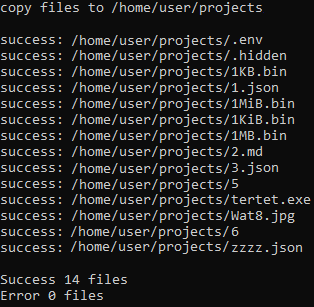

# `files_operations_console_utility`

A utility for performing file operations using multithreading.

The following operations are currently available:
- copy
- move

## CLI
```
Usage:
   main.py --operation=... --from=... --to=... [--threads]=...

Options:
   --operation {copy,move}
                         Operation to be performed on files.
   
   --from SOURCE         The path to the source folder or file.
                         You can also select the necessary files corresponding to the specified mask.
                         Example:
                         /home/user/projects/ - select all files.
                         /home/user/projects/*.md - select files only with the .md extension.
   
   --to DESTINATION      The destination folder path.
   
   --threads THREADS     The number of threads used to perform operation on files.
                         Default - 1 thread.
                         The minimum number of threads is 1.
                         When the source is a file, 1 thread is used.

Examples:
   main.py --operation=copy --from=/home/user/projects --to=/home/output_dir --threads=5
   
Using a mask:
   main.py --operation=copy --from=/home/user/projects/*.md --to=/home/output_dir --threads=2

Move one file:
   main.py --operation=move --from=/home/user/projects/.env --to=/home/output_dir
```

## Example



